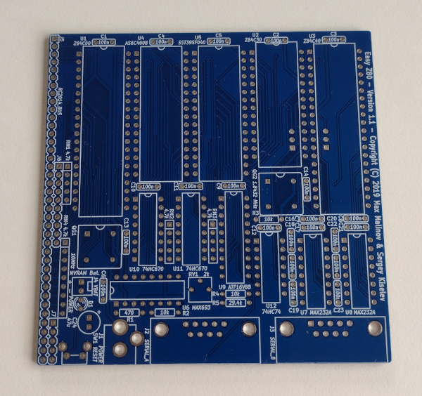
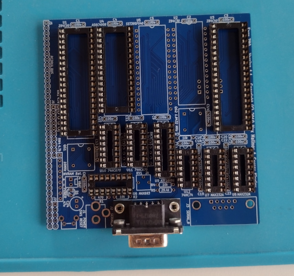

# Easy Z80

Very nice board for Z80 machine with RC2014 bus.

## Bill of Materials

[Project BoM](https://github.com/skiselev/easy_z80?tab=readme-ov-file#bill-of-materials)

### On Hand / Installed

* sockets: 40 pin

### Needed

## References

* [Easy Z80 Github](https://github.com/skiselev/easy_z80)
* [Zilog Z80 CPU Datasheet](https://www.zilog.com/docs/z80/um0080.pdf)
