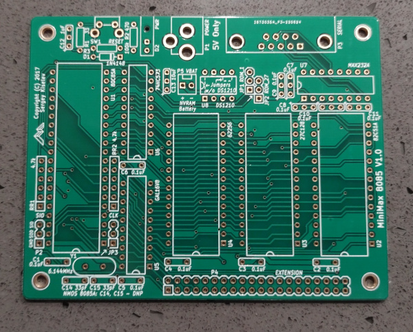
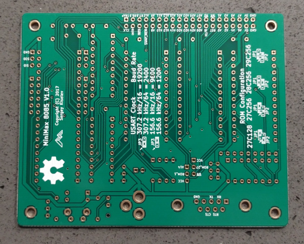

# MiniMax 8085

Build of the [MiniMax 8085](https://github.com/skiselev/minimax8085) board.

## PCB

Very nice board for $12. 

## References

* [Wikipedia 8085](https://en.wikipedia.org/wiki/Intel_8085)
* [8085AH Datasheet](https://www.cryptomuseum.com/crypto/gretag/519/files/D8085AH.pdf)
